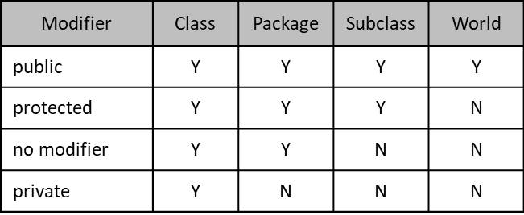

# Access Modifier

- Access Modifier adalah kemampuan membuat class, field, method, dan constructor dapat diakses dari mana saja

    

# Public Class

- Saat kita membuat public class, maka kita hanya bisa membuat 1 public class di 1 file java saja
- Selain itu, nama public class harus sama dengan nama file